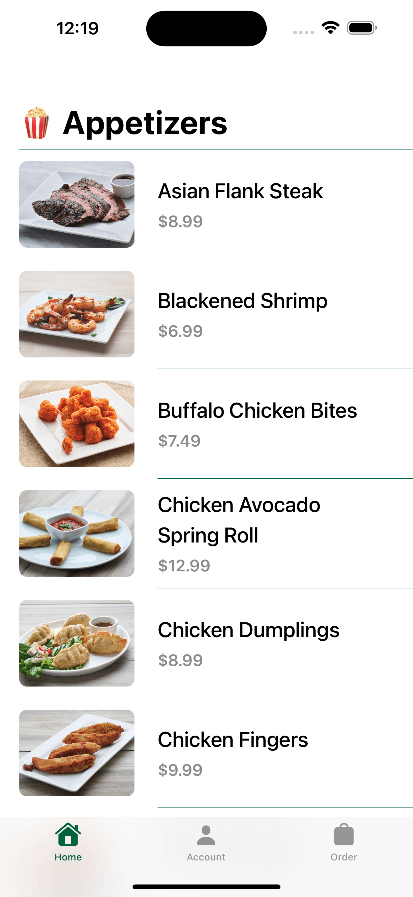
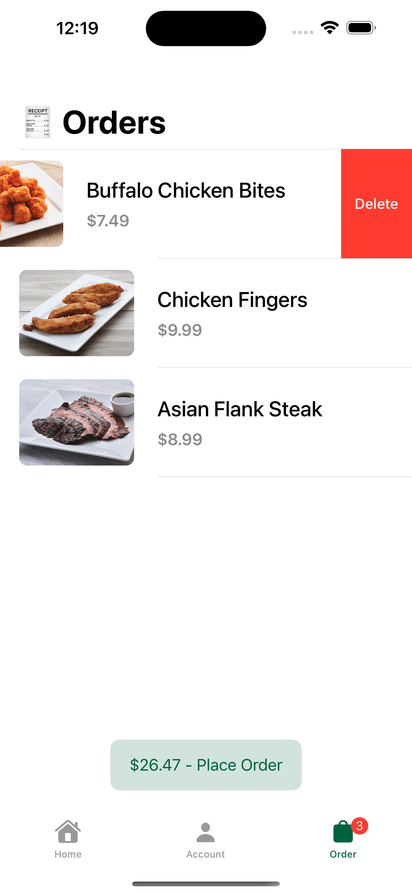
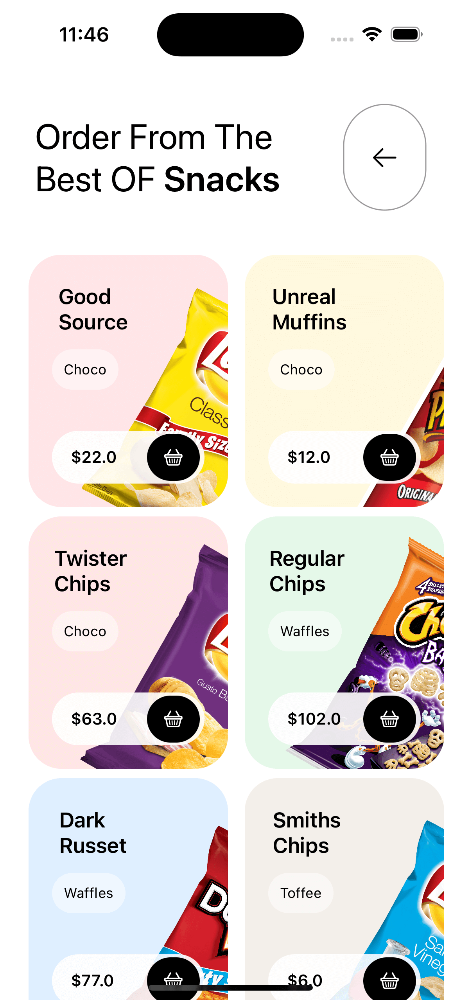

## App List

### Weather App
> /SwiftUI-Weather

#### Screenshots

    
    

### Apple Frameworks
> /Apple-Frameworks

#### Screenshots
#### 1st version

    
    

#### 2nd version

    
    

#### 3rd version

    
    

### Barcode Scanner App
> /SwiftUI-Weather

#### Screenshots

    

### Appetizers
> /Appetizers

#### Screenshots

    
    
    
    
    

### Tax Calculator
> /TaxCalculator

#### Screenshots

    
    

### Photo Gallery (Responsive)
> /PhotoGallery

#### Screenshots

    
    
    
    

### App Store (Mac)
> /AppStore

#### Screenshots

    

### Fitness Companion (Apple Watch)
> /FitnessCompanion

#### Screenshots

    
    
    

### Money Manager
> /MoneyManager

#### Screenshots

    

### Snacks Shop
> /SnacksShop

#### Screenshots

    
    
    
    
    
    

